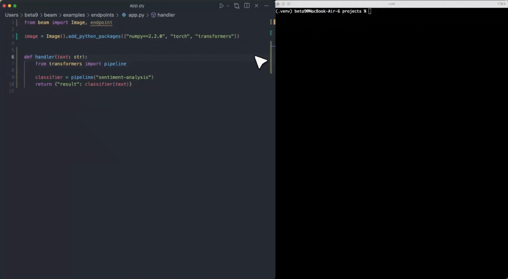

<div align="center">
<p align="center">


</p>

## Run AI Workloads at Scale

<p align="center">
  </a>
    <a href="https://colab.research.google.com/drive/1jSDyYY7FY3Y3jJlCzkmHlH8vTyF-TEmB?usp=sharing">
    
  </a>
  <a href="https://github.com/beam-cloud/beta9/stargazers">
    
  </a>
  <a href="https://docs.beam.cloud">
    
  </a>
  <a href="https://join.slack.com/t/beam-cloud/shared_invite/zt-39hbkt8ty-CTVv4NsgLoYArjWaVkwcFw">
    
  </a>
    <a href="https://twitter.com/beam_cloud">
    
  </a>
    <a href="https://github.com/beam-cloud/beta9?tab=AGPL-3.0-1-ov-file">
    
  </a>
</p>

</div>

**[Beam](https://beam.cloud?utm_source=github_readme)** is a fast, open-source runtime for serverless AI workloads. It gives you a Pythonic interface to deploy and scale AI applications with zero infrastructure overhead.



## ✨ Features

- **Fast Image Builds**: Launch containers in under a second using a custom container runtime
- **Parallelization and Concurrency**: Fan out workloads to 100s of containers
- **First-Class Developer Experience**: Hot-reloading, webhooks, and scheduled jobs
- **Scale-to-Zero**: Workloads are serverless by default
- **Volume Storage**: Mount distributed storage volumes
- **GPU Support**: Run on our cloud (4090s, H100s, and more) or bring your own GPUs

## 📦 Installation

```shell
pip install beam-client
```

## ⚡️ Quickstart

1. Create an account [here](https://beam.cloud?utm_source=github_readme)
2. Follow our [Getting Started Guide](https://platform.beam.cloud/onboarding?utm_source=github_readme)

## Creating a sandbox

Spin up isolated containers to run LLM-generated code:

```python
from beam import Image, Sandbox


sandbox = Sandbox(image=Image()).create()
response = sandbox.process.run_code("print('I am running remotely')")

print(response.result)
```

## Deploy a serverless inference endpoint

Create an autoscaling endpoint for your custom model:

```python
from beam import Image, endpoint
from beam import QueueDepthAutoscaler

@endpoint(
    image=Image(python_version="python3.11"),
    gpu="A10G",
    cpu=2,
    memory="16Gi",
    autoscaler=QueueDepthAutoscaler(max_containers=5, tasks_per_container=30)
)
def handler():
    return {"label": "cat", "confidence": 0.97}
```

## Run background tasks

Schedule resilient background tasks (or replace your Celery queue) by adding a simple decorator:

```python
from beam import Image, TaskPolicy, schema, task_queue


class Input(schema.Schema):
    image_url = schema.String()


@task_queue(
    name="image-processor",
    image=Image(python_version="python3.11"),
    cpu=1,
    memory=1024,
    inputs=Input,
    task_policy=TaskPolicy(max_retries=3),
)
def my_background_task(input: Input, *, context):
    image_url = input.image_url
    print(f"Processing image: {image_url}")
    return {"image_url": image_url}


if __name__ == "__main__":
    # Invoke a background task from your app (without deploying it)
    my_background_task.put(image_url="https://example.com/image.jpg")

    # You can also deploy this behind a versioned endpoint with:
    # beam deploy app.py:my_background_task --name image-processor
```

> ## Self-Hosting vs Cloud
>
> Beta9 is the open-source engine powering [Beam](https://beam.cloud), our fully-managed cloud platform. You can self-host Beta9 for free or choose managed cloud hosting through Beam.

## 👋 Contributing

We welcome contributions big or small. These are the most helpful things for us:

- Submit a [feature request](https://github.com/beam-cloud/beta9/issues/new?assignees=&labels=&projects=&template=feature-request.md&title=) or [bug report](https://github.com/beam-cloud/beta9/issues/new?assignees=&labels=&projects=&template=bug-report.md&title=)
- Open a PR with a new feature or improvement

## ❤️ Thanks to Our Contributors

<a href="https://github.com/beam-cloud/beta9/graphs/contributors">
  
</a>
