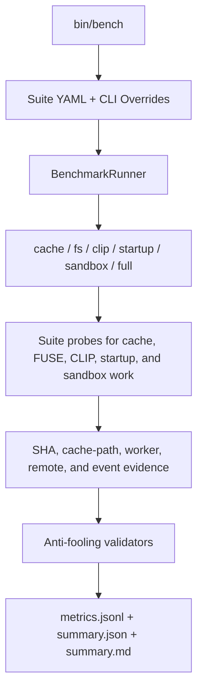

# beta9 Benchmark Framework

`bin/bench` is the entrypoint for structured benchmark runs. Suites are defined
in YAML, run through a consistent suite model, and emit stable JSONL metrics
with correctness and path evidence.

## Architecture



## Examples

```bash
bin/bench cache --suite cache-smoke --dry-run
bin/bench cache --profile local --suite cache-default --out-dir /tmp/beta9-cache-run
bin/bench full --profile local --suite local-full
```

Use `--param key=value` for suite/script overrides, for example:

```bash
bin/bench cache --suite cache-smoke --param require_remote_read=false
```

If `--out-dir` is omitted, every run writes to an ignored execution directory:

```text
benchmarks/runs/<utc timestamp>-<command>-<suite>-<profile>/
```

Each run directory contains:

- `metrics.jsonl`: one graphable metric per probe result.
- `summary.json`: machine-readable aggregate.
- `summary.md`: human-readable table.
- `artifacts/`: raw probe output, logs, and reports.
