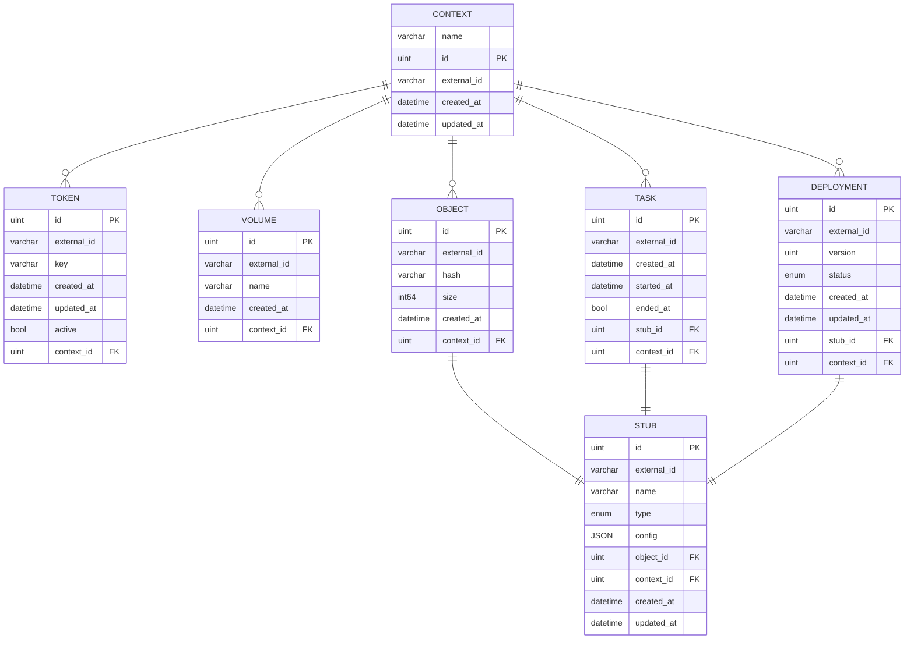

```mermaid

erDiagram

    CONTEXT {
        varchar name
        uint id PK
        varchar external_id
        datetime created_at
        datetime updated_at
    }

    TOKEN {
        uint id PK
        varchar external_id
        varchar key
        datetime created_at
        datetime updated_at
        bool active
        uint context_id FK
    }

    VOLUME {
        uint id PK
        varchar external_id
        varchar name
        datetime created_at
        uint context_id FK
    }

    DEPLOYMENT {
        uint id PK
        varchar external_id
        uint version
        enum status
        datetime created_at
        datetime updated_at
        uint stub_id FK
        uint context_id FK
    }

    TASK {
        uint id PK
        varchar external_id
        datetime created_at
        datetime started_at
        bool ended_at
        uint stub_id FK
        uint context_id FK
    }

    STUB {
        uint id PK
        varchar external_id
        varchar name
        enum type
        JSON config
        uint object_id FK
        uint context_id FK
        datetime created_at
        datetime updated_at
    }

    OBJECT {
        uint id PK
        varchar external_id
        varchar hash
        int64 size
        datetime created_at
        uint context_id FK
    }

    CONTEXT ||--o{ TOKEN : " "
    CONTEXT ||--o{ VOLUME : " "
    CONTEXT ||--o{ DEPLOYMENT : " "
    CONTEXT ||--o{ TASK : " "
    CONTEXT ||--o{ OBJECT : " "
    OBJECT ||--|| STUB : " "
    TASK ||--|| STUB : " "
    DEPLOYMENT ||--|| STUB : " "


```