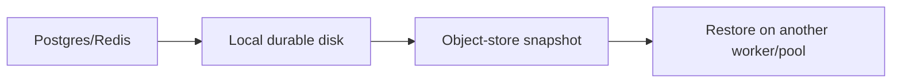
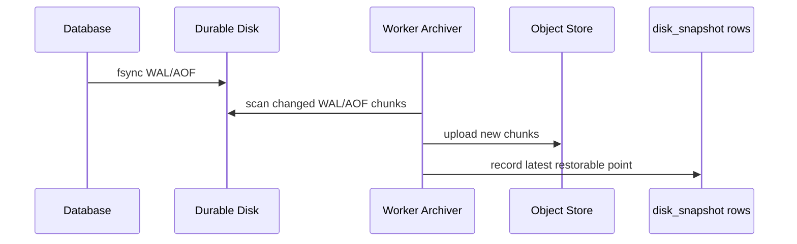
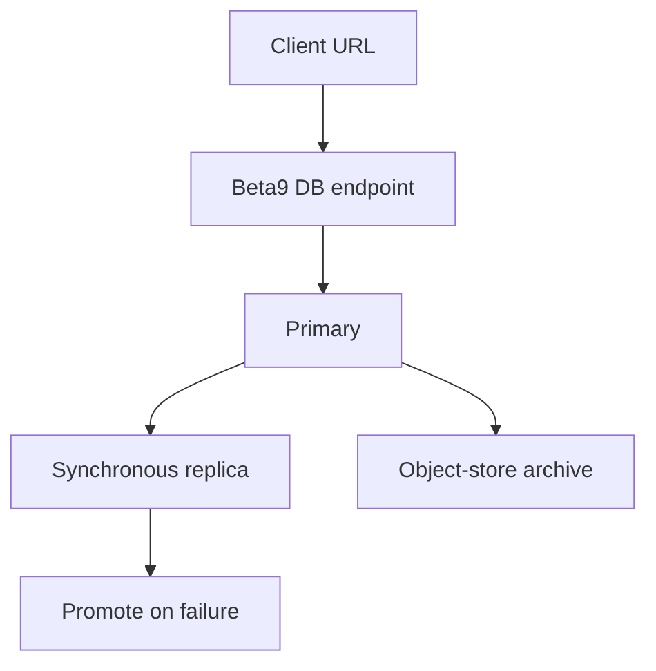

# Stateful Services Enhancement Follow-ups

This is the production hardening plan for durable disks, Postgres, and Redis.
The current implementation is useful and mergeable as a snapshot-durable preview,
but it should not be marketed as zero-loss database HA until the later phases
below are complete.

## Current Shipping Line

Ship the first PR as:

- First-class `beta9 db postgres` and `beta9 db redis` CLI products.
- Serverless by default, with `--always-on` to keep one container warm.
- Single-writer durable disks.
- Object-store snapshots on graceful stop, scale-to-zero, and cleanup.
- Snapshot restore across workers and fallback pools.
- Generic durable disks with snapshot-consistent recovery.

Current snapshots are already incremental and database-aware:

- Postgres uses `postgres.wal.v1` snapshots.
- Redis uses `redis.aof.v1` snapshots.
- Snapshot manifests are chunked and content-addressed.
- Unchanged chunks are reused across snapshots.
- Postgres WAL files under `pgdata/pg_wal/` and Redis `*.aof` files are treated
  as append-only tails, so subsequent snapshots upload new/changed chunks rather
  than the entire disk.

Do not claim:

- Zero committed-write loss on hard node death.
- Redis clustering or Postgres HA.
- Synchronous block replication.

## Phase 0: Merge Guardrails

Goal: make preview semantics impossible to misunderstand.

- Add docs and CLI/status copy: clean shutdown is durable; hard node loss may
  lose writes since the latest completed snapshot.
- Show latest snapshot age in `beta9 db postgres status` and
  `beta9 db redis status`.
- Keep writable durable disks single-container only.
- Label database durability mode as `snapshot` or `bounded_rpo`, not `ha`.
- Keep fallback fail-closed when no restorable snapshot exists.

Acceptance:

- Create/status output makes the hard-failure RPO visible.
- No CLI flag implies multiple writable replicas.
- UI can filter database stubs from `serving.database.kind`.

## Phase 1: Bounded-RPO Live Archival

Goal: reduce hard-node-loss exposure without changing the product architecture.
This is an improvement to snapshot timing and restore points, not a replacement
for the existing WAL/AOF-aware chunk format.

Postgres:

- Keep the existing WAL-aware chunked snapshot format.
- Add live WAL archive flushing while Postgres is running, not only during
  lifecycle cleanup.
- Consider database-aware base backups before raw live `PGDATA` snapshots for
  long-running production databases.
- Restore from latest base backup plus WAL archive.

Redis:

- Keep AOF enabled with strict fsync by default.
- Keep the existing AOF-aware append-only chunk reuse.
- Add live AOF tail flushing while Redis is running, not only during lifecycle
  cleanup.
- Restore from latest base snapshot plus AOF tail.

Generic durable disks:

- Keep chunked directory snapshots.
- Document as snapshot-consistent only; apps must fsync and tolerate the
  configured snapshot RPO.

Acceptance:

- Staging kill test after waiting for archive flush restores all writes before
  the last recorded archive point.
- Hard kill during active writes reports measured data loss window.
- Snapshot uploads remain incremental for large disks.
- Restore verifies file ownership, modes, symlinks, and data integrity.

## Phase 2: Zero-Loss Database Products

Goal: guarantee no committed database writes are lost on a single node failure.

Postgres:

- Run an internal primary plus synchronous standby set behind one product
  endpoint.
- Configure synchronous commit and synchronous standby names.
- Promote the in-sync standby on primary failure.
- Keep object-store base/WAL archives for full pool loss and disaster recovery.

Redis:

- Choose an explicit safe-write design:
  - Redis/Valkey plus a managed write path that issues `WAIT` for mutating
    commands, or
  - a consensus Redis-compatible engine, or
  - synchronous block replication underneath Redis.
- Keep AOF and object-store archive for disaster recovery.
- Do not market plain async Redis replication as zero-loss.

Acceptance:

- Kill the primary node during acknowledged writes with no missing committed
  sequence numbers after failover.
- Kill all nodes in a private pool and restore from object-store archive into a
  fallback pool.
- Add nodes back to the private pool and restore the same data there.
- Fail closed if no synchronous replica or archive can satisfy the durability
  policy.

## Phase 3: Generic Durable Disk Hardening

Goal: make arbitrary durable disks production-useful without overstating them.

- Expose snapshot schedule/RPO in SDK and CLI.
- Add manual snapshot and restore commands.
- Add snapshot retention policy.
- Add snapshot integrity checks and restore drills.
- Keep generic disks single-writer unless a real replicated block layer exists.

Acceptance:

- A sandbox/function/service can mount a durable disk, write fsynced data,
  snapshot it, restore on a different worker, and verify exact contents.
- Large disks only upload changed chunks.
- Full pool loss restores from object storage without relying on JuiceFS or the
  original worker.

## Required Staging Matrix

Run before calling any phase production-ready:

- Clean scale-to-zero and wake for Postgres, Redis, and a generic disk.
- DB container kill and restart on the same pool.
- Worker/node kill after archive flush.
- Worker/node kill during active writes, measuring RPO.
- Full private-pool loss with restore into fallback pool.
- Private pool returns; restore latest data there.
- Hetzner two-node private-pool run.
- Tailscale/private TCP connectivity across nodes and pools.

Evidence to collect:

- Commands used.
- Deployment IDs and worker IDs.
- Latest snapshot/archive IDs and ages.
- Written sequence range and restored sequence range.
- Object-store bucket/prefix used for each disk.
- Any observed data loss window.
