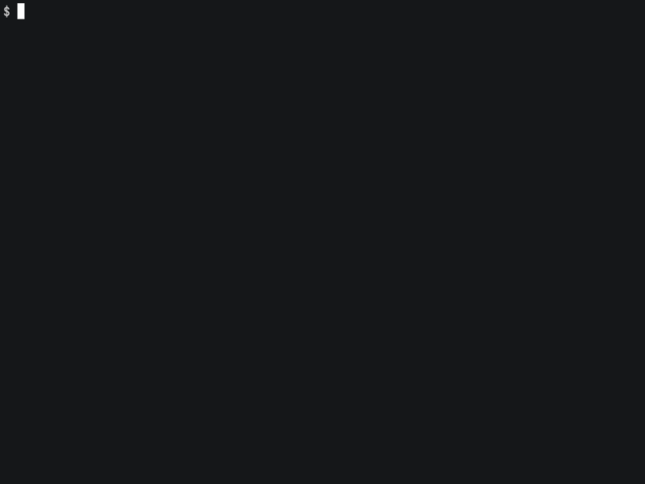
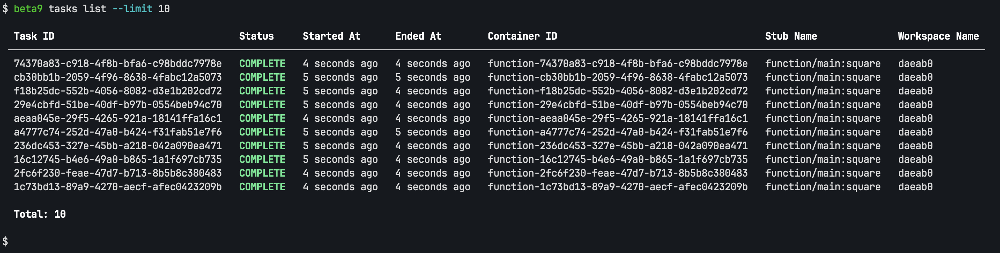

# beta9 sdk

Python SDK for Beta9.

## Getting started

### Using the SDK

This example will run the `square` function on beta9. Each invocation of `square` will run in a separate runc space.

```python
from beta9 import function

@function(
    cpu=0.25,
    gpu="L4",
)
def square(i: int):
    return i**2

def main():
    numbers = list(range(10))
    squared = []

    for result in square.map(numbers):
        squared.append(result)

    print("numbers:", numbers)
    print("squared:", sorted(squared))

if __name__ == "__main__":
    main()

```

### Running the SDK

Let's run the code we just wrote. You can see we invoke the function 10 times.




### Using the CLI

Finally lets check the results using the CLI.


